# Practice Analysis on a Healthcare Dataset with R

## Overview
A statistical analysis of 55,500 patient records, working from exploratory visualization through formal hypothesis testing and into regression modeling. The central question was which factors drive patient billing amount, and whether any of them could be targeted to reduce costs.

The answer turned out to be none of them, and understanding why became the most interesting result of the project.

## Dataset
Healthcare records from Kaggle with 55,500 rows and 15 columns, where each row represents an individual patient.

| Column | Description |
|---|---|
| `Name` | Patient name |
| `Age` | Patient age |
| `Gender` | Patient gender |
| `blood_type` | Blood type |
| `medical_condition` | Diagnosed condition |
| `admission_date` | Date of admission |
| `Doctor` | Attending physician |
| `Hospital` | Hospital name |
| `insurance` | Insurance provider |
| `billing_amount` | Total billed amount |
| `room_number` | Room number |
| `admission_type` | Elective, Emergency, or Urgent |
| `discharge_date` | Date of discharge |
| `Medication` | Medication provided |
| `test_results` | Normal, Abnormal, or Inconclusive |

A derived variable, `length_of_stay`, was calculated as the difference between discharge and admission dates.

## Research Questions

**Primary:** What factors affect billing amount the most, and what steps could be taken to minimize that amount for patients? Specifically, do admission type, medical condition, age, test result, or length of stay affect billing amount, and which has the strongest impact?

**Secondary:**
- What are the test result proportions across the dataset?
- What is the age distribution per medical condition?
- Does length of stay vary by medical condition?
- Does insurance provider affect average length of stay?
- Do gender, age, blood type, or medical condition significantly affect test results, with Normal as the baseline?
- Does admission type predict length of stay?

## Part 1: Exploratory Visualization

Test results split almost perfectly evenly across Normal, Abnormal, and Inconclusive, and patient counts by gender are nearly identical.

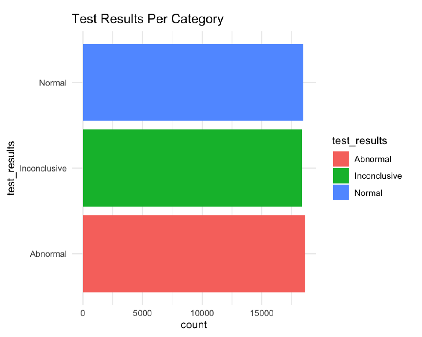
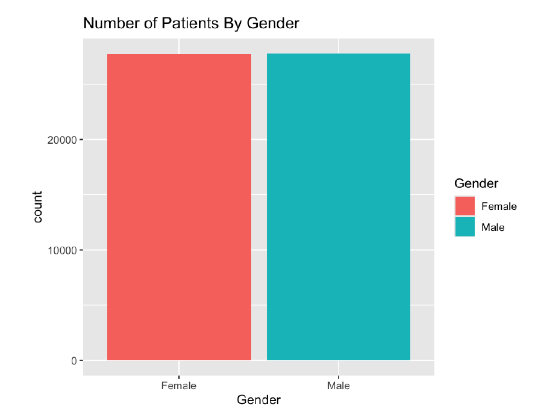

Length of stay is essentially uniform across all six medical conditions, with densities hovering flat around 0.03 from day 1 through day 30. Age distributions are likewise near identical across conditions, all centered close to a median of 52 with comparable spread.

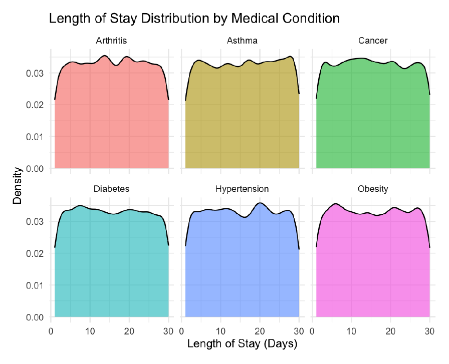
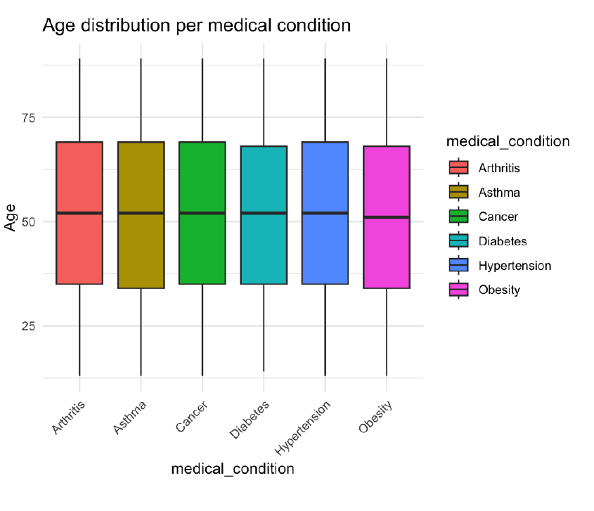

These flat, uniform distributions were the first signal that something unusual was going on in the data.

## Part 2: Hypothesis Testing

### One sample t tests (α = 0.05)
| Test | Hypothesis | p-value | Result |
|---|---|---|---|
| Age | H₀: µ = 51.5 | 0.64 | Failed to reject H₀ |
| Billing amount | H₀: µ = 25,539 | 0.99 | Failed to reject H₀ |

### ANOVA: does medication type affect billing amount?
H₀: Mean billing amount is the same across all 5 medication types
H₁: At least one medication type differs significantly

F = 1.139, p = 0.336 → **failed to reject H₀**

### Linear regression: does age predict billing amount?
R² = 0.0000146, p = 0.3667 → **failed to reject H₀**

### Two sample t test: billing amount by test result
Comparing Normal against Abnormal test results: t = 0.55, p = 0.58 → **failed to reject H₀**

## Part 3: Regression Modeling

### Does insurance provider affect length of stay?
A linear regression across five insurance providers produced no significant coefficients. Every provider p-value fell between 0.111 and 0.946, and the model explained essentially none of the variance.

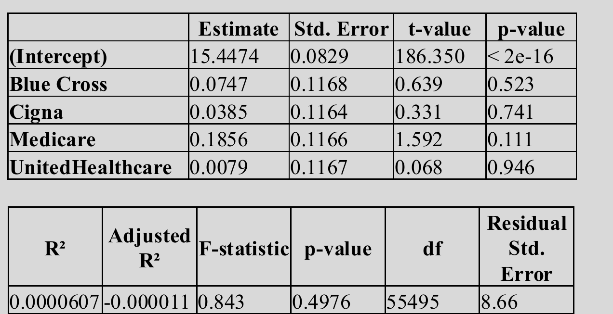

R² of 0.0000607 with a **negative adjusted R²** of -0.000011 is the clearest possible signal of no relationship: adjusting for the number of predictors makes the model perform worse than an intercept-only baseline. Overall model p-value was 0.4976.

### Do gender, age, blood type, or medical condition predict test results?
A multinomial logistic regression with Normal as the reference level was fit across both alternative outcomes.

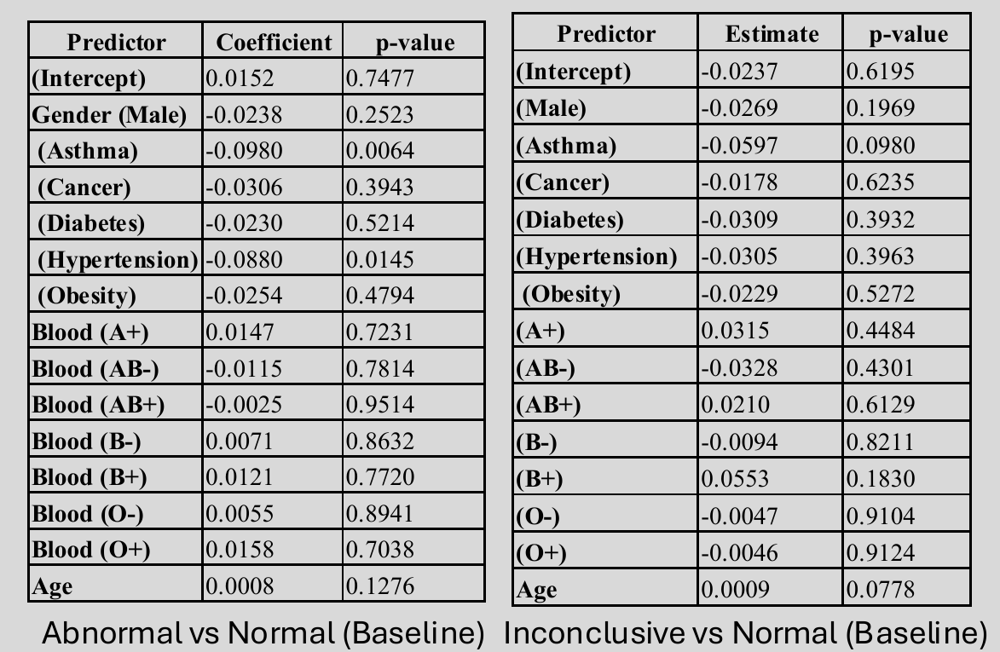

Two predictors reached significance in the Abnormal versus Normal comparison: Asthma at p = 0.0064 and Hypertension at p = 0.0145. Neither held up in the Inconclusive versus Normal comparison (p = 0.0980 and p = 0.3963 respectively). Given the number of coefficients estimated across both models, two isolated significant results that fail to replicate across outcomes are most plausibly false positives rather than real effects.

### Does admission type affect length of stay?
H₀: Mean length of stay is the same across all 3 admission types
H₁: At least one admission type differs significantly

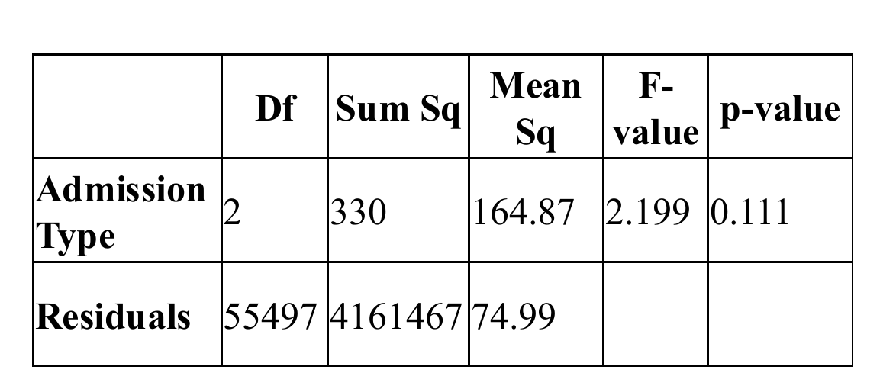
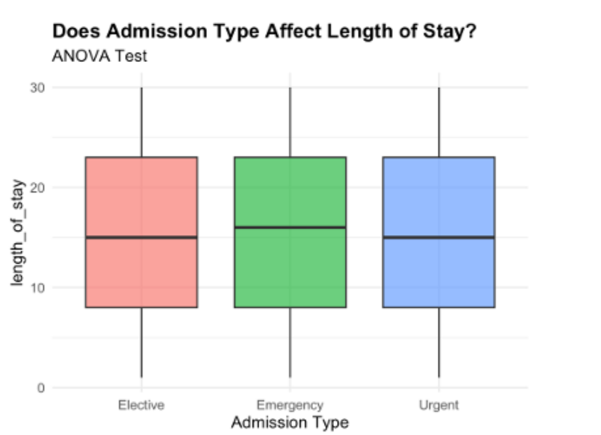

F = 2.199, p = 0.111 → **failed to reject H₀**. The boxplots are visually near identical, with medians clustered between 15 and 16 days across all three types.

### Billing amount against every candidate predictor
Average billing is effectively flat across admission types, and billing distributions by medical condition are nearly indistinguishable.

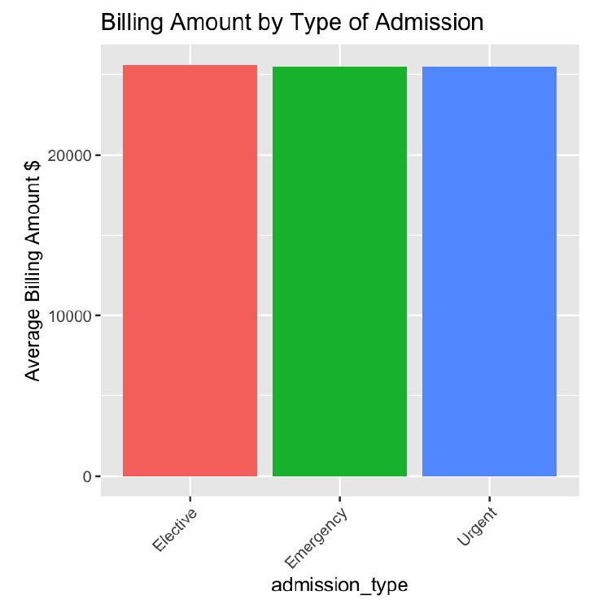
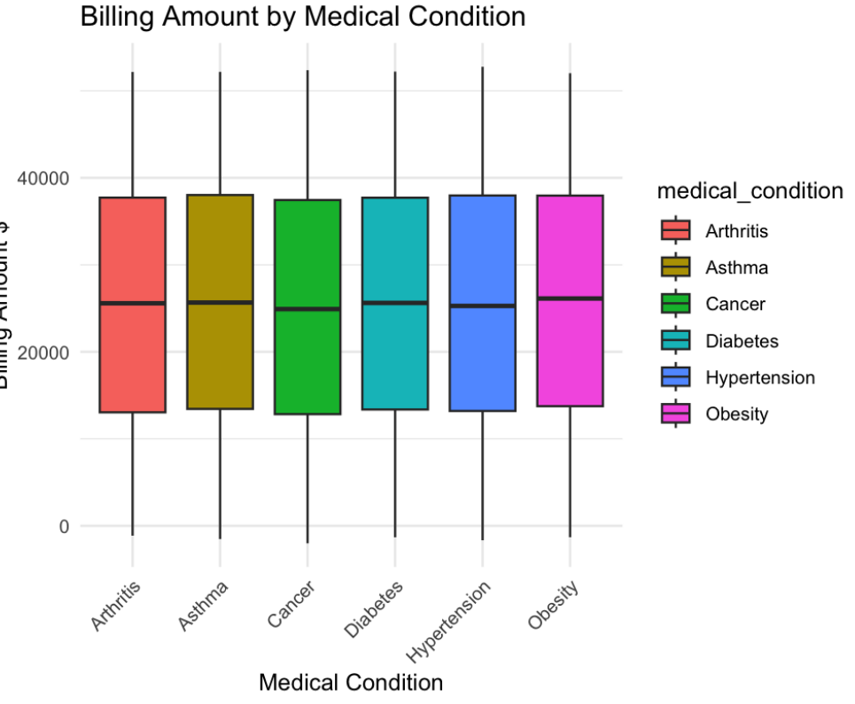

The regression of billing amount on length of stay produces the most striking visual in the project: 55,500 points spanning the full billing range at every single day of stay, with a fitted line that is completely horizontal.

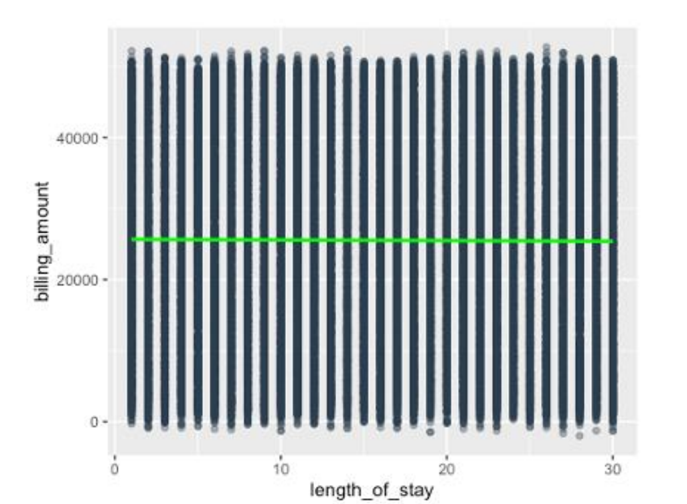

## Conclusion

**No variable produced a statistically significant relationship with any outcome** across every hypothesis test and regression model in this analysis. Age, medication type, admission type, insurance provider, and length of stay all failed to predict billing amount.

The most likely explanation is that this dataset is **synthetically generated with each variable drawn independently**. That would account for the uniform distributions, the flat regression lines, the near zero and even negative adjusted R² values, and the complete absence of the relationships that real healthcare data reliably shows. Billing in an actual hospital system tracks length of stay, procedure intensity, and condition severity closely, and none of that structure is present here.

Rather than a failed analysis, this is a useful negative result: the statistical tests correctly detected the absence of signal, and the pattern of results across many independent tests points to the data generation process rather than to any single modeling choice.

## Methods and Tools
Analysis performed in **R** using `dplyr`, `tidyverse`, `ggplot2`, and `nnet`.

Techniques applied:
- String cleaning with `gsub()` and regex to strip honorifics from names and normalize hospital names
- Column renaming to snake_case and rounding of billing amounts
- Derivation of `length_of_stay` from date arithmetic
- Descriptive statistics and NA auditing with `colSums(is.na())`
- Visualization with `geom_col()`, `geom_boxplot()`, `geom_density()` with `facet_wrap()`, and `geom_point()` with `geom_smooth(method = "lm")`
- One sample and two sample t tests via `t.test()`
- One way ANOVA via `aov()`
- Simple and multiple linear regression via `lm()`
- Multinomial logistic regression via `nnet::multinom()`, with the reference level set using `relevel()` and p-values computed manually from z-scores

## Repository Structure
Each script is self-contained and includes the shared data cleaning block, as the milestones were submitted and run independently.

| Script | Stage | Contents |
|---|---|---|
| `Visualizations_EDA.R` | Milestone 1 | Descriptive statistics and six exploratory visualizations |
| `Hypothesis_testing.R` | Milestone 2 | t tests, ANOVA, and linear regression |
| `Final.R` | Final delivery | Regression models, multinomial logistic regression, and ANOVA with plots |

## Reference
Healthcare Dataset. (n.d.). Kaggle. https://www.kaggle.com/datasets/prasad22/healthcare-dataset/data
